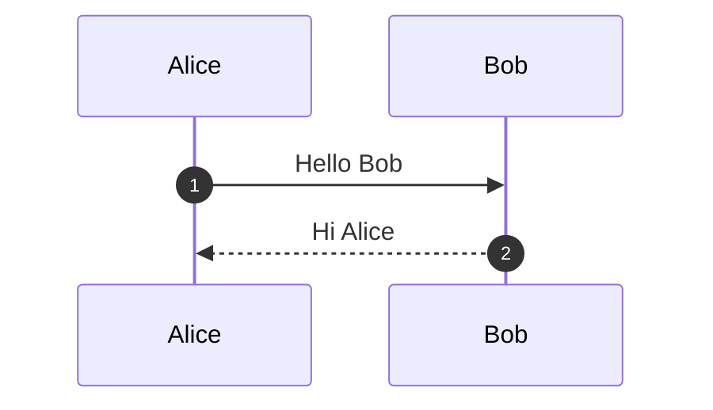
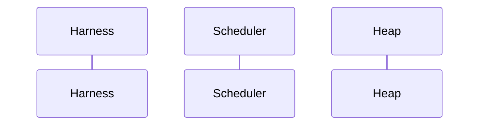
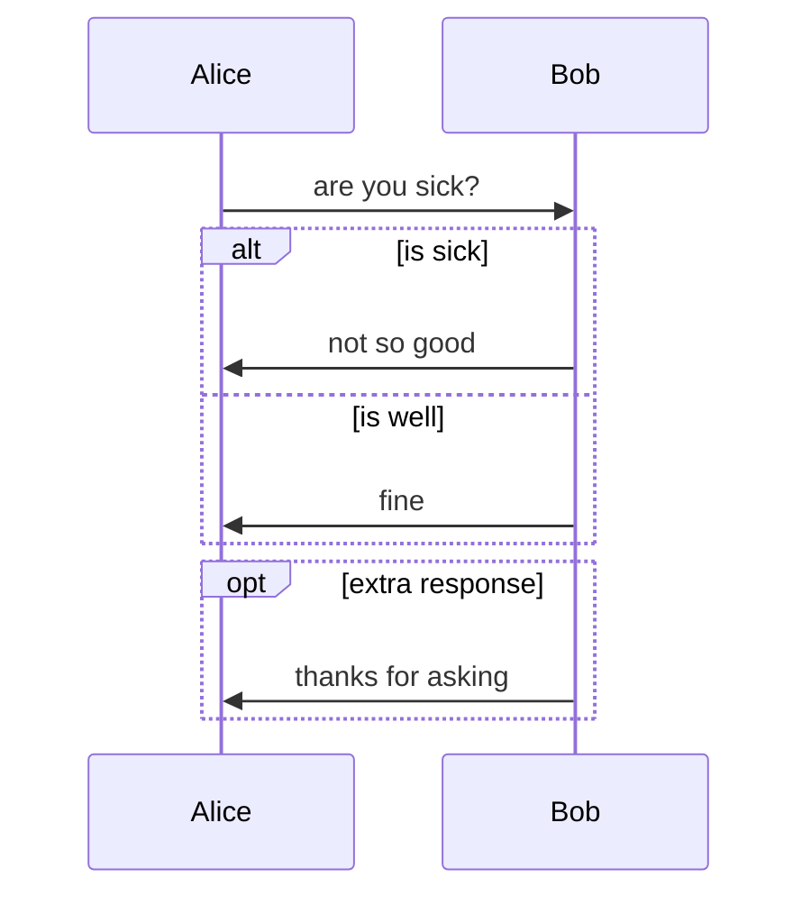
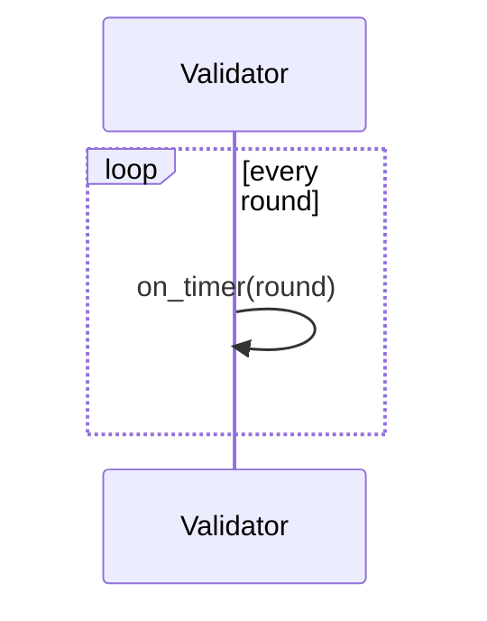
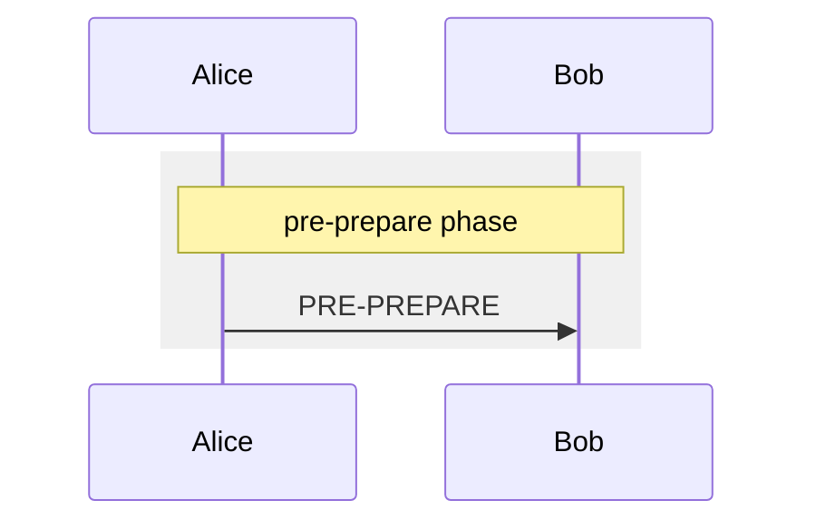
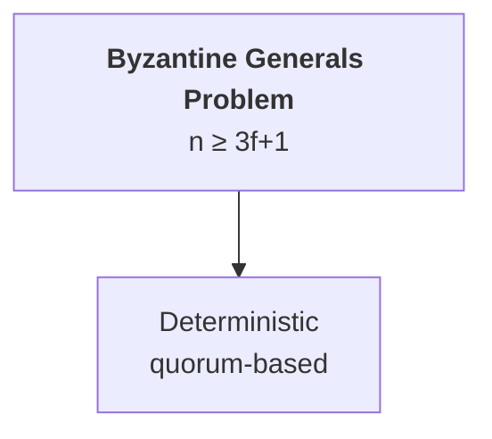
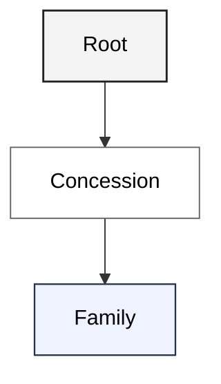

# Mermaid syntax — project reference

The canonical Mermaid reference for this thesis's diagrams. Two diagram
types are in use; this file pins the subset of Mermaid syntax we rely on
and is the source of truth referenced by `docs/draft-style.md` and
`wiki/diagrams/index.md`.

**Upstream source.** Curated from the official Mermaid documentation on
the `develop` branch:

- `sequenceDiagram` — <https://github.com/mermaid-js/mermaid/blob/develop/docs/syntax/sequenceDiagram.md>
- `flowchart` — <https://github.com/mermaid-js/mermaid/blob/develop/docs/syntax/flowchart.md>

Fetched 2026-05-26. When syntax questions arise that this page does not
answer, re-fetch the upstream files and extend this page — do not improvise.

**Render path.** All diagrams render to PDF via the Mermaid CLI:

```bash
PUPPETEER_SKIP_DOWNLOAD=true \
  npx --yes @mermaid-js/mermaid-cli@latest \
  -p <puppeteer-config.json> \
  -i wiki/diagrams/<group>/<slug>.md \
  -o wiki/diagrams/<group>/<slug>.pdf \
  -b transparent -t neutral
```

`mmdc` reads ```` ```mermaid ```` fenced blocks directly from Markdown;
no `.mmd` extraction is needed. `puppeteer-config.json` points
`executablePath` at the system Chrome to skip Mermaid CLI's bundled
Chromium download.

---

## 1. `sequenceDiagram`

Used for every protocol main loop, every scheduler-contract diagram, and
the macro runtime view. Currently 10 diagrams under `wiki/diagrams/`.

### 1.1 Skeleton



- First line must be `sequenceDiagram`.
- `autonumber` (optional) numbers every arrow line. Use it on every
  thesis diagram so prose can refer to "step 7" unambiguously.

### 1.2 Participants and ordering

Participants render in the order they are declared. To lock left-to-right
order, declare every participant up front:



- `participant Name` — rectangle (default; preferred for this thesis).
- `participant Name as Display<br/>Name` — alias with `<br/>` line break.
- `actor Name` — stick figure. **Do not use** in this thesis; we are
  modelling software components, not human roles.

### 1.3 Arrows

| Mermaid | Visual | Use it for |
| :-- | :-- | :-- |
| `A->>B: msg` | solid line, arrowhead | a synchronous call, a network send |
| `A-->>B: msg` | dotted line, arrowhead | a return value, a response to a prior call |
| `A->B: msg` | solid line, no arrowhead | (avoid — ambiguous) |
| `A-->B: msg` | dotted line, no arrowhead | (avoid — ambiguous) |

Bold or other emphasis goes in the message label as HTML:
`A->>B: <b>RunResult</b>` renders the message text in bold. Mermaid
sequence labels accept `<br/>`, `<b>`, `<i>`. Line breaks in labels:
`Alice->>Bob: Hello,<br/>how are you?`.

The asynchronous open-arrow form (`A-)B: msg`) and bidirectional
(`A<<->>B`) are not used in this thesis.

### 1.4 Notes

| Form | Use it for |
| :-- | :-- |
| `Note over A: text` | annotation tied to one lifeline |
| `Note over A,B: text` | annotation spanning two or more lifelines |
| `Note left of A: text` / `Note right of A: text` | edge annotation |

`Note over <leftmost>,<rightmost>: text` is the workhorse for
cross-lifeline annotations and for the lightweight section dividers we
inherit from Swimlanes (`-: text` → `Note over A,Z: text`).

### 1.5 Alternatives and options



- `alt` / `else` / `end` — `n`-way branch (at least one `alt`, zero or
  more `else`, one `end`). Maps directly to Swimlanes `if: ... / else /
  end`.
- `opt` / `end` — single-arm optional. Maps to Swimlanes `if:` with no
  `else`.

### 1.6 Loops



- `loop label` / `end` — repeated section. We use this for protocol
  main-loop iterations (Casper FFG epoch loop, Snowman `K`-peer poll
  loop, Narwhal round loop).

### 1.7 Background grouping (`rect`)



- `rect <color>` / `end` — visually shaded background block. The color
  takes `rgb(r,g,b)` or `rgba(r,g,b,a)`. We use this to translate
  Swimlanes' heavy `=:` section dividers into a visible block.

**Convention for this thesis.** Heavy section dividers use
`rect rgb(240,240,240)` (light gray, prints well in B&W) with a
`Note over <leftmost>,<rightmost>: <b>phase name</b>` as the first line
inside the rect. Light section dividers use a bare
`Note over <leftmost>,<rightmost>: phase name` with no rect.

### 1.8 Comments

`%%` at the start of a line is a line-level comment. Mermaid strips it
before rendering. Use it for non-rendering authoring notes — e.g. pinning
the source spec a diagram traces to.

### 1.9 The `end` gotcha

The word `end` (lowercase) breaks the parser when it appears in a
participant name or message text. Workaround: capitalise (`End`) or
enclose in brackets (`[end]`, `(end)`, `{end}`). This thesis avoids
`end` as a message word; protocol vocabulary already uses `commit`,
`finalize`, `decide`.

### 1.10 What we deliberately do not use

- `actor` participants (no human roles).
- Activation bars (`+`/`-` on arrows) — visual clutter without
  information; our diagrams already show lifeline involvement clearly
  through arrows.
- `par` / `and` — parallel sections; expressible via independent
  message ordering in our diagram style.
- `critical` / `break` — exception-handling regions; our protocols
  model failures as message loss, view-change, or slashing, not as
  exception flow.
- Actor menus, links, and CSS classes (`Classes used` section
  upstream) — the thesis PDF is the only render target.

---

## 2. `flowchart`

Used for taxonomy and component diagrams where there is no time axis.
Currently one diagram: `wiki/diagrams/concepts/bft-families-tree.md`.

### 2.1 Skeleton and direction


- First line must be `flowchart <direction>`.
- Direction: `TD` or `TB` (top-down — preferred for taxonomy), `LR`
  (left-to-right), `BT`, `RL`. The thesis taxonomy diagrams are `TD`.

### 2.2 Nodes



- `id["label"]` — rectangle node with an HTML-capable label.
- Inside the label: `<br/>` for line break, `<b>...</b>` for bold,
  `<i>...</i>` for italic. Unicode is fine inside `"..."`.
- Alternative shapes (`id(rounded)`, `id((circle))`, `id{diamond}`,
  `id[[subroutine]]`) exist but are not used in this thesis — our
  taxonomy diagrams use the default rectangle uniformly so visual weight
  carries no extra semantics.

### 2.3 Edges

| Mermaid | Visual |
| :-- | :-- |
| `A --> B` | solid arrow (preferred) |
| `A --- B` | solid line, no arrow |
| `A -.-> B` | dotted arrow |
| `A ==> B` | thick arrow |
| `A -- text --> B` | arrow with edge label |

This thesis uses `A --> B` exclusively for parent → child relations in
taxonomy trees.

### 2.4 Classes (visual hierarchy)



- `classDef <name> <css-like-properties>` — define a visual class.
  Supported keys we use: `fill`, `stroke`, `stroke-width`, `color`.
- `class <node>[,<node>...] <className>` — apply a class to one or more
  nodes.
- The `:::className` shorthand (`A:::root --> B`) works but is harder
  to scan; prefer the `class` statement so visual grouping is visible
  in one block.

**Convention for this thesis.** Taxonomy levels each get their own
`classDef`. Light gray for the root problem, white for concession-axis
nodes, light blue for deployed-family leaves — the convention already
codified in `wiki/diagrams/concepts/bft-families-tree.md` and which any
new taxonomy diagram inherits.

### 2.5 What we deliberately do not use

- Node-shape variety beyond the rectangle (subgraph, double-circle,
  trapezoid, etc.). Our taxonomies do not encode information in shape.
- Subgraphs (`subgraph ... end`). The flat tree we currently render is
  legible without grouping boxes; revisit if a future diagram nests.
- `linkStyle` numeric link styling. Edges in our diagrams carry no
  semantic distinction.
- FontAwesome icons, image shapes, animations, click interactions —
  none of these reach the printed thesis.

---

## 3. Extending this page

**Upstream index of all diagram types** (browse here for any type not
yet covered below):

<https://github.com/mermaid-js/mermaid/tree/develop/docs/syntax>

Every diagram type Mermaid ships has a sibling `.md` under that tree
(e.g. `classDiagram.md`, `stateDiagram.md`, `erDiagram.md`,
`gitgraph.md`, `gantt.md`, `mindmap.md`, …). The `develop` branch tracks
the current Mermaid release; the per-file URL pattern is
`https://github.com/mermaid-js/mermaid/blob/develop/docs/syntax/<type>.md`.
Fetch with `gh api repos/mermaid-js/mermaid/contents/docs/syntax/<type>.md?ref=develop --jq '.content' | base64 -d`.

When a future diagram needs a Mermaid primitive or type not listed here:

1. **New primitive within an existing type** (`sequenceDiagram`,
   `flowchart`): pull the relevant section from the per-type doc URL
   pinned at the top of this page. Add it to the matching subsection
   above with one minimal example and a one-line note on when to use
   it.
2. **New diagram type** (`classDiagram`, `stateDiagram`, etc.): pull
   the matching `<type>.md` from the upstream tree URL above. Add a new
   top-level `## N. <type>` section here — same shape as §§1–2 — before
   authoring the first instance. Pin the upstream source URL at the top
   of the new section so future re-fetches do not re-derive it.
3. Do not improvise syntax from training-data recall. Mermaid's surface
   evolves between releases; the upstream `develop` doc is the only
   authority.

The `## 1.10 / 2.5 What we deliberately do not use` subsections are
load-bearing: they record decisions that a future agent might otherwise
re-litigate. Append to them when ruling a primitive out; do not silently
drop the rationale.
