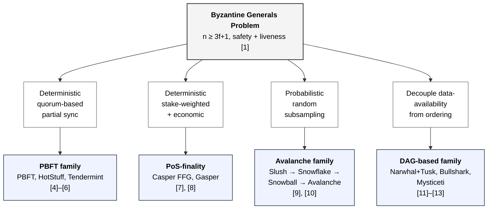

# BFT families — propagation tree

> Taxonomic tree showing how the four Layer-1 consensus families this
> thesis evaluates descend from the Byzantine Generals Problem [1].
> Each branch is a principled relaxation along the synchrony or
> fault-model axis rather than an arbitrary engineering choice.
> Mechanism references: [[algorithms/pbft]], [[algorithms/pos]],
> [[algorithms/avalanche]], [[algorithms/dag-based]]. Concept reference:
> [[concepts/consensus-families#propagation-of-the-bft-problem]].
>
> Navigation entry point: [[diagrams/index]]. Owning page:
> [[concepts/consensus-families]] (consumed by Chapter 2 §2.3, Figure 2.1).
>
> Notation: Mermaid `flowchart TD`. This is the first diagram in the
> set authored in Mermaid; the legend in [[diagrams/index]] § Mermaid
> syntax pins the primitives used.

## Diagram

## What this pins

**Three layers, read top-to-bottom.** Row 1 is the shared origin
problem [1]. Row 2 is the *concession axis* — which assumption each
family relaxes relative to the others. Row 3 is the deployed family
that occupies that point in the concession space. The reader should
walk the figure as "BGP → which knob is loosened → which family
results."

**Four sibling branches, not three plus a child.** The earlier draft
of the propagation tree in [[concepts/consensus-families]] drew the
DAG-based family as a *child* of the deterministic branch; this
figure promotes it to a fourth sibling so that the four families the
thesis evaluates appear at the same depth. The semantic claim is that
data-availability/ordering decoupling is a concession on the same
axis (what to relax against partial synchrony) rather than a
sub-variant of any one family.

**Citation numerals match Chapter 2's reference list.** `[1]` is
Lamport, Shostak, Pease (Byzantine Generals); `[4]–[6]` are
PBFT/HotStuff/Tendermint; `[7], [8]` are Casper FFG and Gasper;
`[9], [10]` are Avalanche and its formal re-analysis; `[11]–[13]` are
Narwhal+Tusk, Bullshark, Mysticeti.

**Boxes carry no quantitative claim.** The figure is taxonomic, not
quantitative. Fault thresholds, finality types, and metric
vocabularies are pinned by Table 2.1 in the chapter and by the
family-comparison row in [[concepts/consensus-families]].

## Cross-links

- Origin problem: [[concepts/byzantine-generals]],
  [[concepts/flp-impossibility]], [[concepts/synchrony-models]].
- Concession axes: [[concepts/fault-model]],
  [[concepts/quorum-arithmetic]], [[concepts/cap-theorem]].
- Family pages: [[algorithms/pbft]], [[algorithms/pos]],
  [[algorithms/avalanche]], [[algorithms/dag-based]].
- Consumer: `drafts/ch2_litreview.md` §2.3 (Figure 2.1).
- Adjacent concept synthesis:
  [[concepts/consensus-families#propagation-of-the-bft-problem]].

## Source

Authored ad-hoc on 2026-05-26 alongside the T36 Chapter 3 work, in
response to a request to redraw Figure 2.1 in a standard diagram
format. First diagram in the thesis to use Mermaid rather than
Swimlanes.io; the choice is motivated in [[diagrams/index]] §
Mermaid syntax — Swimlanes is sequence-flow oriented and cannot
express a taxonomy tree idiomatically.

## Revisions

None.
