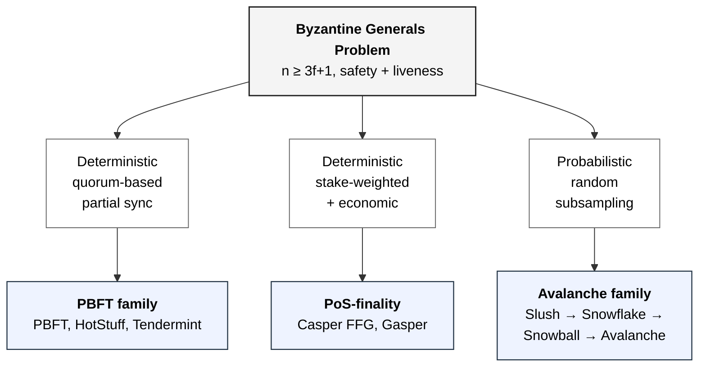

# BFT families — propagation tree

> Taxonomic tree showing how the three Layer-1 consensus families this
> thesis evaluates descend from the Byzantine Generals Problem [1].
> Each branch is a principled relaxation along the synchrony or
> fault-model axis rather than an arbitrary engineering choice.
> Mechanism references: [[algorithms/pbft]], [[algorithms/pos]],
> [[algorithms/avalanche]]. Concept reference:
> [[concepts/consensus-families#propagation-of-the-bft-problem]].
>
> Navigation entry point: [[diagrams/index]]. Owning page:
> [[concepts/consensus-families]] (consumed by Chapter 2 §2.3, Figure 2.1).
>
> Notation: Mermaid `flowchart TD`. This is the first diagram in the
> set authored in Mermaid; the legend in [[diagrams/index]] § Mermaid
> syntax pins the primitives used.

## Diagram

## What this pins

**Three layers, read top-to-bottom.** Row 1 is the shared origin
problem [1]. Row 2 is the *concession axis* — which assumption each
family relaxes relative to the others. Row 3 is the deployed family
that occupies that point in the concession space. The reader should
walk the figure as "BGP → which knob is loosened → which family
results."

**Three sibling branches at one depth.** Each of the three families
the thesis evaluates hangs at the same depth from the Byzantine
Generals root, one per concession axis. A fourth, DAG-based family
(Narwhal+Tusk, Bullshark, Mysticeti) decouples data availability from
ordering on the same axis but is not implemented in this thesis — it
is named only as a direction for further work (Chapter 6) and is
therefore not drawn here.

**No citation numerals in the figure.** The boxes name the origin
problem and the protocols only; the supporting citations (Lamport-
Shostak-Pease for the Byzantine Generals Problem; PBFT/HotStuff/
Tendermint; Casper FFG and Gasper; Avalanche and its formal
re-analysis) live in the Chapter 2 §2.1 body prose, where the
`\cite` keys resolve through biblatex. Bracketed numerals were
removed from the diagram because a baked-in image cannot track the
compiled bibliography's numbering, and the old hardcoded `[4]–[10]`
labels had drifted out of sync with the LaTeX reference list.

**Boxes carry no quantitative claim.** The figure is taxonomic, not
quantitative. Fault thresholds, finality types, and metric
vocabularies are pinned by Table 2.1 in the chapter and by the
family-comparison row in [[concepts/consensus-families]].

## Cross-links

- Origin problem: [[concepts/byzantine-generals]],
  [[concepts/flp-impossibility]], [[concepts/synchrony-models]].
- Concession axes: [[concepts/fault-model]],
  [[concepts/quorum-arithmetic]], [[concepts/cap-theorem]].
- Family pages: [[algorithms/pbft]], [[algorithms/pos]],
  [[algorithms/avalanche]].
- Consumer: `drafts/ch2_litreview.md` §2.3 (Figure 2.1).
- Adjacent concept synthesis:
  [[concepts/consensus-families#propagation-of-the-bft-problem]].

## Source

Authored ad-hoc on 2026-05-26 alongside the T36 Chapter 3 work, in
response to a request to redraw Figure 2.1 in a standard diagram
format. The first diagram in the thesis to land in Mermaid; the
subsequent 2026-05-26 Swimlanes.io → Mermaid migration brought the
remaining 10 sequence diagrams onto the same toolchain.

## Revisions

- **2026-06-29.** Removed the bracketed citation numerals (`[1]`, `[4]–[6]`,
  `[7], [8]`, `[9], [10]`) from the four boxes. The baked-in numerals were the
  old markdown numbering and no longer matched the compiled biblatex
  bibliography (where those numbers resolve to deployment-incident sources, not
  the protocol papers). A taxonomic figure does not need inline citations — the
  protocols are cited in the §2.1 body prose — so the numerals were dropped
  rather than re-baked, which would only re-desync on the next bib edit. `.svg`/
  `.pdf` regenerated from the updated Mermaid source.
- **2026-06-24.** Removed the fourth (DAG-based) family branch — node `D`
  ("Decouple data-availability from ordering") and `D1` ("Narwhal+Tusk,
  Bullshark, Mysticeti", `[11]–[13]`). The thesis was descoped to three
  implemented families (PBFT, Casper FFG, Snowman); Narwhal+Tusk is now future
  work only (Chapter 6). The figure, its caption, and Chapter 2 §2.3 prose now
  all read "three families". The `.svg`/`.pdf` renders were regenerated from the
  updated Mermaid source on the same date.
