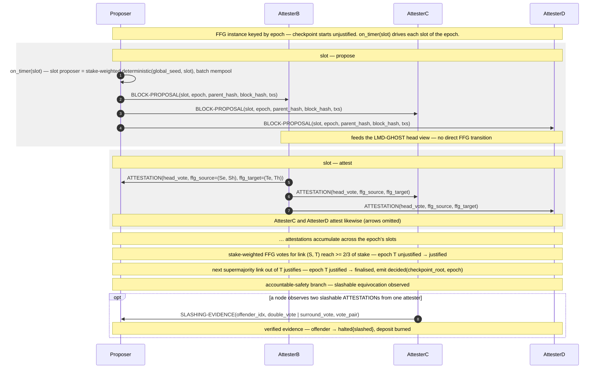

# Casper FFG — Main Loop

> One epoch's checkpoint through Casper FFG's two-round
> justify-then-finalise gadget, plus the accountable-safety branch when
> equivocation is observed. Mechanism reference:
> [[algorithms/pos#two-round-finalisation]]. FSM states:
> [[concepts/node-model]] §4. Message catalog:
> [[concepts/message-types]] §4.
>
> Navigation entry point: [[diagrams/index]]. Owning page:
> [[concepts/system-design-protocols]] §3.

## Diagram

## What this pins

**Finality is two linked supermajorities, not one.** A checkpoint
becomes `justified` when a `<source, target>` link collects ≥ 2/3 of
stake; it becomes `finalised` only when the *next* epoch's link
justifies on top of it. The two-round structure is what makes the
FFG transition lag the attestations by a full epoch.

**No commit message exists.** Unlike PBFT's explicit `COMMIT`,
finalisation is a *locally evaluable predicate* over accumulated
`ATTESTATION` stake ([[concepts/message-types]] §4). The handler tallies
stake; the `unjustified → justified → finalised` transitions fire when
the tally crosses 2/3. Only `decided` is emitted.

**Threshold is stake-weighted, not a node count.** Casper's `f < 1/3`
is a fraction of total stake ([[concepts/node-model]] §2); the handler
sums `attester.weight`, it does not count attestations.

**The proposer schedule is seed-derived, not RANDAO.** The slot
proposer is a stake-weighted `deterministic(global_seed, slot)` — an
FSM-level derivation identical on every node, independent of `self.rng`
([[concepts/node-model]] §5). The simulator does not model RANDAO.

**Slashing is a halt, not just a metric.** A verified
`SLASHING-EVIDENCE` drives the offender to `halted{slashed}`
([[concepts/node-model]] §3) and burns its deposit — the accountable-
safety mechanism the T53/T54 equivocation experiments measure.

## Cross-links

- Mechanism: [[algorithms/pos#two-round-finalisation]].
- FSM states and `decided`: [[concepts/node-model]] §4.
- Message schemas (incl. `SLASHING-EVIDENCE`): [[concepts/message-types]] §4.
- Adversary attachment (double / surround vote, proposer equivocation):
  [[concepts/adversary-model]] §5, §7.
- Pseudocode: [[concepts/system-design-protocols]] §3.

## Source

Authored as part of T20 ([[concepts/system-design]]).

## Revisions

None.
