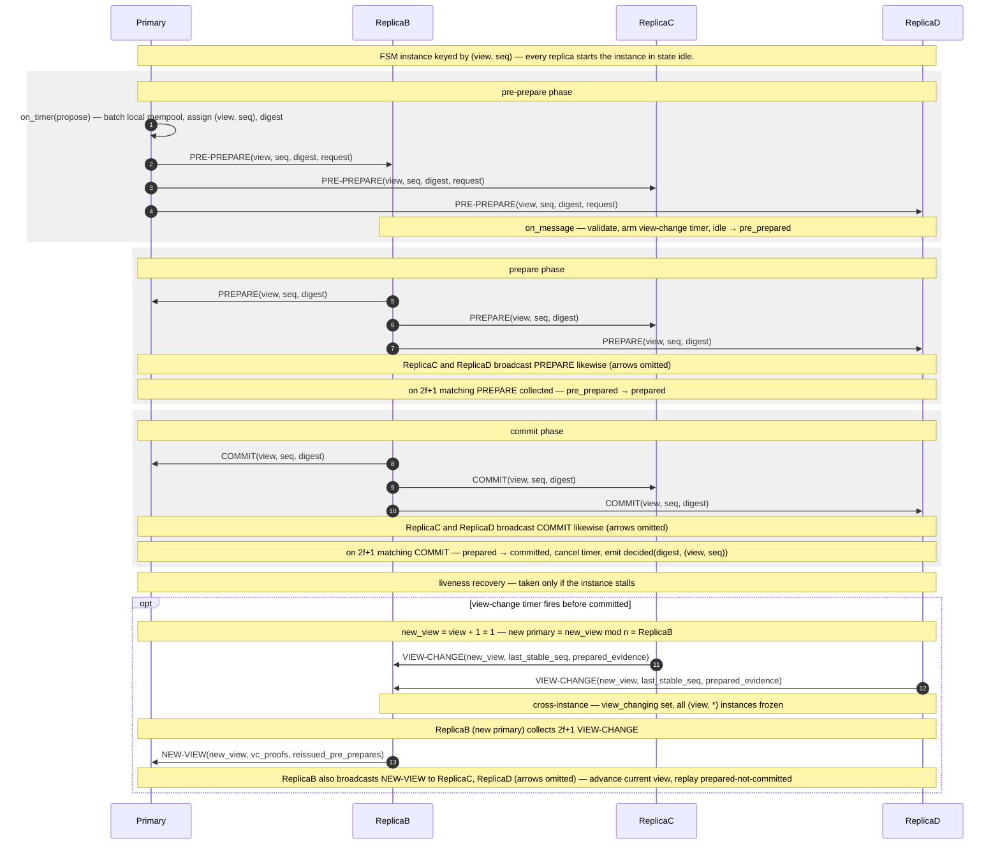

# PBFT — Main Loop

> One `(view, seq)` consensus instance through PBFT's three-phase
> commit, plus the view-change branch taken when the instance stalls.
> Mechanism reference: [[algorithms/pbft#three-phase-commit]] and
> [[algorithms/pbft#view-change]]. FSM states:
> [[concepts/node-model]] §4. Message catalog: [[concepts/message-types]] §3.
>
> Navigation entry point: [[diagrams/index]]. Owning page:
> [[concepts/system-design-protocols]] §2.

## Diagram

## What this pins

**Two broadcast quorum rounds, one digest.** PREPARE and COMMIT each
cost an all-to-all broadcast — `O(n²)` messages per instance — but
carry only the 32-byte digest, not the request payload
([[concepts/message-types]] §3). Only `PRE-PREPARE` carries the batch.

**The FSM transition is quorum-triggered, not message-triggered.** A
replica advances `pre_prepared → prepared` on the *2f+1-th* matching
PREPARE, not on each one. The handler counts; the transition fires once
the count crosses threshold. Same pattern for `prepared → committed`.

**`decided` is emitted once, on commit.** Reaching `committed` is the
instance's terminal state ([[concepts/node-model]] §4); the
`decided(value, instance_id, t)` event is the latency / throughput
anchor the metric layer consumes. No separate finalise message exists.

**View change is a fallback edge, not the main path.** The `if` branch
runs only when the view-change timer (armed at `pre_prepared`) fires
before `committed`. It freezes every instance at the current view,
elects `new_view mod n` as the next primary, and replays
prepared-but-not-committed work — the `O(n³)` worst case the family
pays for liveness ([[algorithms/pbft#view-change]]).

**`Primary` is also a replica.** It runs the prepare/commit handlers
like everyone else ([[concepts/node-model]] §5); the diagram omits its
PREPARE/COMMIT arrows only to reduce clutter.

## Cross-links

- Mechanism: [[algorithms/pbft#three-phase-commit]],
  [[algorithms/pbft#view-change]].
- FSM states and `decided`: [[concepts/node-model]] §4.
- Message schemas and byte budget: [[concepts/message-types]] §3.
- Adversary attachment (primary equivocation, leader-disruptor):
  [[concepts/adversary-model]] §5, §6.
- Pseudocode: [[concepts/system-design-protocols]] §2.

## Source

Authored as part of T20 ([[concepts/system-design]]).

## Revisions

None.
