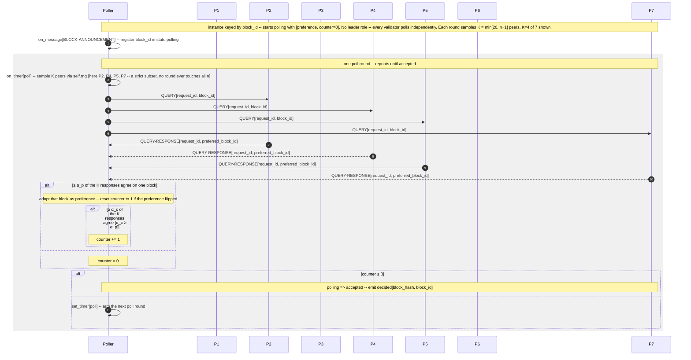

# Snowman — Main Loop

> One block through Snowman's subsampled-poll loop: repeated `K`-peer
> sampling until the confidence counter reaches `β`. Mechanism
> reference: [[algorithms/avalanche#snowman--linearised-production]] and
> [[algorithms/avalanche#sampling-round]]. FSM states:
> [[concepts/node-model]] §4. Message catalog:
> [[concepts/message-types]] §5.
>
> Navigation entry point: [[diagrams/index]]. Owning page:
> [[concepts/system-design-protocols]] §4.

## Diagram

## What this pins

**The loop is a self-rearming timer, not a `while`.** Each poll round
ends by either accepting the block or calling `set_timer(poll)` to
schedule the next round. The "main loop" is this timer re-arming —
there is no scheduler-visible loop construct ([[concepts/node-model]]
§6 "No `on_tick`").

**Cost is `O(K·β)`, independent of `n`.** Each round is `K` unicast
`QUERY` / `QUERY-RESPONSE` pairs ([[concepts/message-types]] §5); a
block is accepted after ~`β` successful rounds. No message ever touches
all `n` validators — the diagram samples K=4 of 7 peers — the property
that distinguishes Snowman from the three quorum-broadcast protocols.

**Confidence accumulates; it does not vote.** There is no quorum and no
commit message. Two thresholds act per round: a simple-majority `α_p`
updates the preference, and the higher `α_c` raises the confidence
counter; a round below `α_p` resets the counter to zero. Acceptance at
`counter ≥ β` is a purely local decision.

**Sampling must flow through `self.rng`.** Peer selection is the
protocol's main randomness source and is seeded per-node
([[concepts/node-model]] §8) so two seed-identical runs sample
identically.

**Finality is probabilistic.** Acceptance gives a `1 − ε` guarantee
with `ε < (1 − α_c/K)^β`, not the deterministic finality of PBFT or
Casper FFG — the safety/latency trade-off Chapter 4 foregrounds.

## Cross-links

- Mechanism: [[algorithms/avalanche#snowman--linearised-production]],
  [[algorithms/avalanche#sampling-round]].
- FSM states and `decided`: [[concepts/node-model]] §4.
- Message schemas (`QUERY` / `QUERY-RESPONSE` unicast):
  [[concepts/message-types]] §5.
- Adversary attachment (lying responder, colluding sub-sampler):
  [[concepts/adversary-model]] §5, §7.
- Parameter rescaling (`K`, `α_c`, `β`) at thesis-scale `n`:
  [[concepts/metric-reconciliation]].
- Pseudocode: [[concepts/system-design-protocols]] §4.

## Source

Authored as part of T20 ([[concepts/system-design]]).

## Revisions

None.
