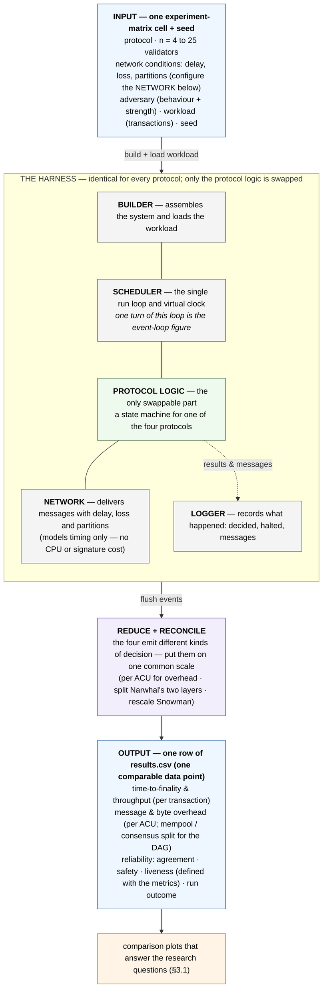

# Simulator Architecture — One Engine, Any Protocol

> The static picture of the simulator for Chapter 3 §3.2: what the system
> is made of, what goes in, what comes out, and where the four protocols
> differ. One experiment-matrix cell plus a seed enters a fixed engine and
> leaves as one comparable row of `results.csv`. The engine is identical
> for every protocol — the only swappable part is the protocol logic.
>
> This is the **structural** companion to [[diagrams/runtime/macro]] (which
> tells the same "cell → row" story as a *temporal* sequence) and to
> [[diagrams/runtime/event-loop]] (which zooms into the Scheduler's run
> loop). The per-protocol decide rules this figure points at are catalogued
> in [[concepts/system-design-protocols]] and normalised in
> [[concepts/metric-reconciliation]].
>
> Navigation entry point: [[diagrams/index]]. Owning page:
> [[concepts/system-design]] §2.

## Diagram

## What this pins

**One config cell → one comparable data point.** The input is a single
cell of the experiment matrix plus a seed — protocol, validator count `n`,
network conditions, adversary, workload, seed. These are the independent
variables the research questions sweep ([[concepts/experiment-matrix]],
[[concepts/research-questions]]). The output is one row of `results.csv`.
The harness iterates this figure once per `(cell, seed)`.

**The engine is fixed — but that alone is not "fairness."** Builder,
Scheduler, Network and Logger are identical for every protocol, so any
difference in the results comes from the protocol logic, not the harness
(its RNG, scheduling, or network model). That *isolates* protocol
behaviour. Making four different decisions *comparable* is the separate
**reduce + reconcile** step, and that is where commensurability is
established — under stated conventions, not by the engine being shared
([[concepts/metric-reconciliation]]). §3.2 prose owns the conventions and
the caveats (task T36.3).

**Only the protocol-logic slot swaps.** The four protocols decide by
genuinely different rules and do not even produce the same *kind* of
decision (a PBFT block, an FFG checkpoint-plus-ancestors, a Snowman block,
a Narwhal anchor-batch). The slot is drawn generic here; the per-protocol
control spines and decide rules live in
[[concepts/system-design-protocols]], and their atomic-commit-unit (ACU)
definitions in [[concepts/metric-reconciliation]].

**The adversary is a `Node`-local slot, not a layer.** It attaches to a
node and alters that node's outbound messages; its effect is
protocol-specific (there is no leader to disrupt in Snowman). Drawn as an
input knob for brevity; it lives inside the swappable region
([[concepts/adversary-model]], [[concepts/node-model]] §9).

**The Network models timing only.** Delay, loss and partitions — no CPU or
cryptographic cost. This is a stated threat to validity (it favours
signature-heavy protocols); §3.2 prose names it (T36.3).

**Metric reduction is harness-side.** The Scheduler never computes a
metric; the Logger's `decided` / `halted` / message events are reduced and
reconciled by the harness ([[concepts/simulation-design-runtime]] §2,
[[concepts/output-format]]). Rates are *not* uniformly per-ACU: overhead is
per ACU, throughput and time-to-finality are per transaction
([[concepts/evaluation-metrics]]).

## Cross-links

- The same run as a temporal sequence: [[diagrams/runtime/macro]].
- One turn of the Scheduler's run loop: [[diagrams/runtime/event-loop]].
- Per-protocol control spines and decide rules (the swappable slot):
  [[concepts/system-design-protocols]], [[diagrams/protocols/pbft]],
  [[diagrams/protocols/casper-ffg]], [[diagrams/protocols/snowman]],
  [[diagrams/protocols/narwhal-tusk]].
- Input axes and iteration: [[concepts/experiment-matrix]].
- Output schema and per-ACU normalisation:
  [[concepts/output-format]], [[concepts/metric-reconciliation]],
  [[concepts/evaluation-metrics]].
- Architecture prose and component table: [[concepts/system-design]] §2.

## Source

Authored for Chapter 3 §3.2 (2026-06-09), as the structural-architecture
companion to the macro sequence view, after a three-reviewer design pass.
The §3.2 prose obligations this figure defers (commensurability
conventions, no-compute-cost threat, FFG↔network coherence guard, workload
realism, scaling-range limit, Snowman rescaling validity, deadline-vs-
liveness detection, reliability-family definitions) are tracked as task
T36.3.

## Revisions

None.
