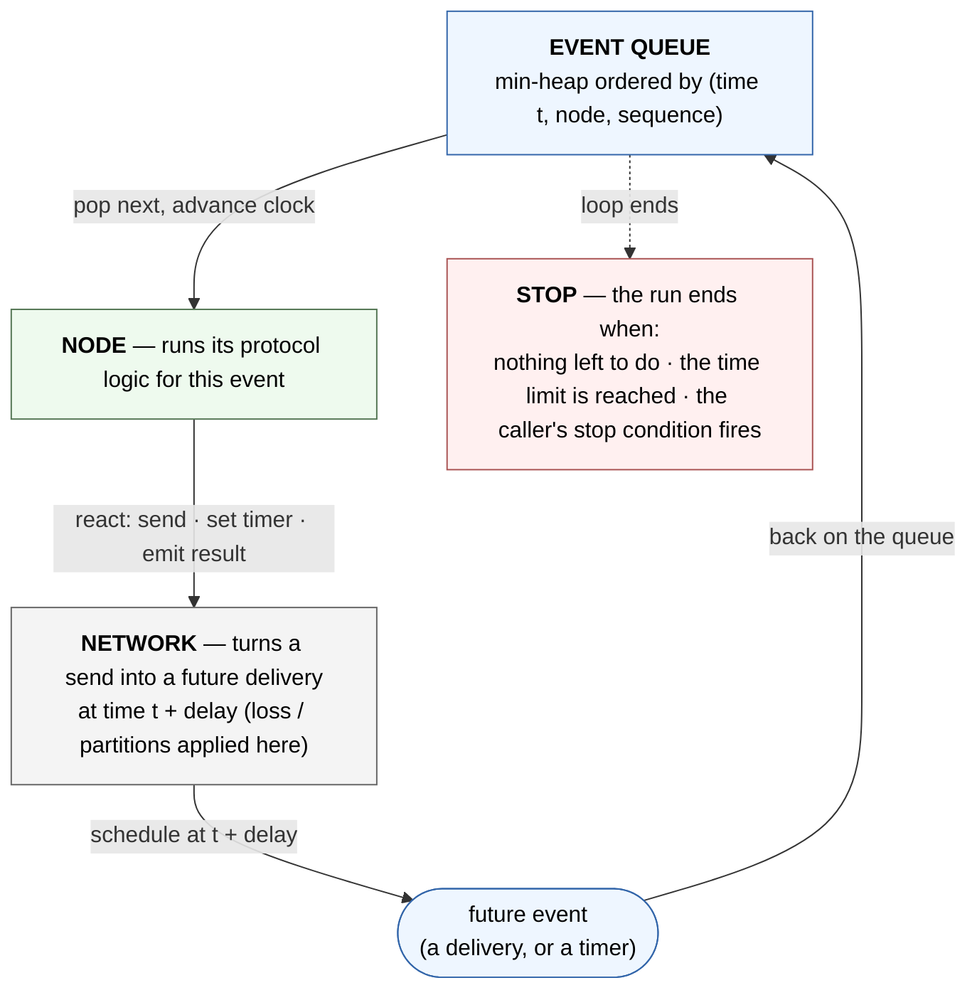

# Simulator Runtime — Engine Event Loop

> The dynamic picture for Chapter 3 §3.2: how one event is processed and
> how simulated time advances. A zoom into the Scheduler box of
> [[diagrams/runtime/architecture]]. The engine repeats one cycle until the
> run ends — take the next-soonest event, advance the clock to it, let a
> node react, and put whatever that produces back on the queue. The loop is
> identical for all four protocols; only the per-protocol state machine
> inside the NODE box differs (drawn in [[diagrams/runtime/architecture]]
> and detailed in [[concepts/system-design-protocols]]).
>
> Navigation entry point: [[diagrams/index]]. Owning pages:
> [[concepts/simulation-design]] (scheduler), [[concepts/system-design]] §3.

## Diagram

The three exit paths are recorded as `quiescence` (nothing left to do),
`deadline` (time limit reached), and `predicate` (the caller's condition).
A `deadline` stop is **not** automatically a failure — whether it is a real
liveness failure is judged separately, by whether the target decision was
reached before the deadline ([[concepts/output-format]]).

## What this pins

**The clock jumps, it does not tick.** Each turn the scheduler takes the
earliest event and sets the virtual clock straight to that event's
timestamp `t`; nothing happens between events, so the run skips idle gaps
instead of waiting through them. This is about efficiency, not yet
reproducibility ([[concepts/simulation-design]] §4).

**Why a run replays identically.** Determinism rests on three things
together: the queue's total order `(t, node, sequence)` — so even two
events at the same `t` have one definite order — per-node RNGs seeded from
the run seed, and the rule that nothing reads a wall clock or iterates in a
nondeterministic order. Clock-jumping alone would not guarantee it
([[concepts/reproducibility]], [[concepts/simulation-design-runtime]] §1).

**One feedback path drives the whole system.** A node only reacts by
sending a message, setting a timer, or emitting a result (`decided` /
`halted`, which the Logger records). Sends and timers become future events
on the queue; there is no other source of work, so this single loop is the
entire dynamics ([[diagrams/scheduler/event-enqueue]]).

**Each component has one job in the running loop.** Scheduler owns the
loop, the clock and the queue. Node runs the protocol logic on the event
handed to it. Network is pure latency — it turns a "send" into a delayed
"deliver" and is the only place loss and partition live. Metric reduction
is harness-side, not in this loop ([[diagrams/scheduler/constraints]]).

**One loop fulfils all four protocols.** The pop → react → enqueue cycle is
identical for every family; only the state machine inside the NODE box
swaps. That swappable slot — including Narwhal+Tusk's two-layer
mempool/consensus structure — is drawn in
[[diagrams/runtime/architecture]] and detailed in
[[concepts/system-design-protocols]].

**Termination is a queue predicate, not a wall clock.** The loop ends when
the heap empties (`quiescence`), the clock reaches `t_max` (`deadline`), or
a caller `stop_when()` fires (`predicate`) — the same three exit paths the
macro view carries into the `RunResult` ([[diagrams/runtime/macro]]).

## Cross-links

- Where this loop sits in the whole system:
  [[diagrams/runtime/architecture]], [[diagrams/runtime/macro]].
- Scheduler contract (clock, heap, enqueue, dispatch, stop paths):
  [[diagrams/scheduler/event-dispatch]], [[diagrams/scheduler/event-enqueue]],
  [[concepts/simulation-design]] §4–§6.
- The per-protocol state machine inside the NODE box:
  [[concepts/system-design-protocols]], [[diagrams/protocols/pbft]],
  [[diagrams/protocols/casper-ffg]], [[diagrams/protocols/snowman]],
  [[diagrams/protocols/narwhal-tusk]].
- Network latency / loss / partition model: [[concepts/network-model]].
- Determinism and the single-seed guarantee: [[concepts/reproducibility]].

## Source

Authored for Chapter 3 §3.2 (rewritten 2026-06-09 from the earlier
working draft: English labels, a protocol-generic NODE box, the
`(t, node, sequence)` ordering key, and the three-legged determinism
statement), after a three-reviewer design pass alongside
[[diagrams/runtime/architecture]].

## Revisions

None.
