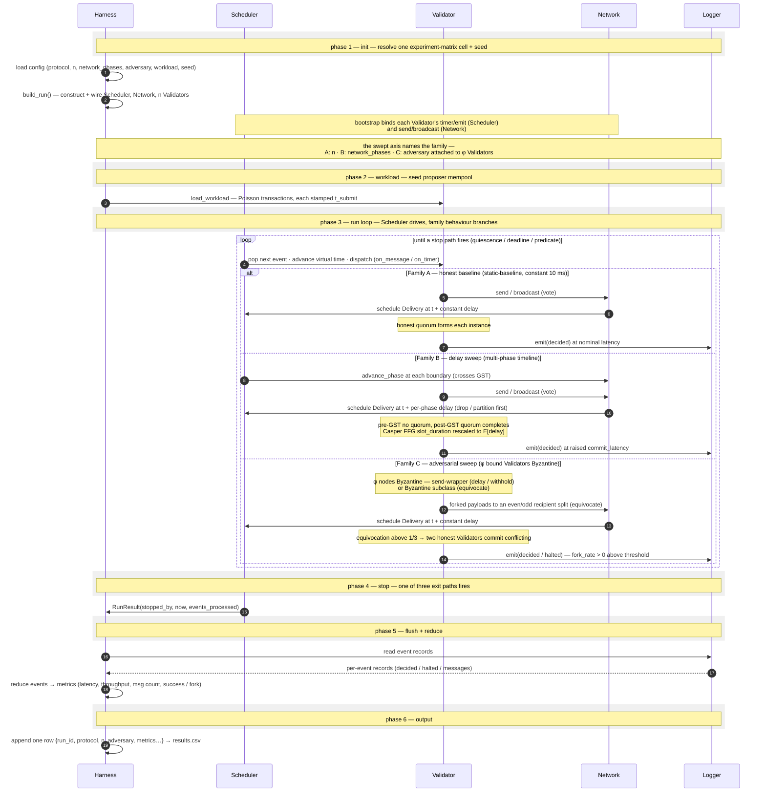

# Simulator Runtime — Macro View

> The whole simulator at one abstraction level above the T17 scheduler
> contract: from one experiment-cell config to one row of `results.csv`.
> Six phases — init, workload, run loop, stop, flush, output — over five
> named lanes (Harness, Scheduler, Validator, Network, Logger). The
> `run loop` phase branches by experiment family (Family A baseline /
> Family B delay / Family C adversarial) and otherwise zooms into the five
> scheduler contract diagrams catalogued in [[diagrams/index]]; the
> bootstrap inside `build_run()` zooms into [[diagrams/scheduler/bootstrap]].
>
> Navigation entry point: [[diagrams/index]]. Owning page:
> [[concepts/system-design]] §3.

## Diagram

## What this pins

**One config cell → one CSV row.** The diagram is the unit of work the
experiment harness ([[concepts/experiment-matrix]], T19) iterates. A
full experiment is this sequence run once per `(cell, seed)` pair; the
matrix page owns the iteration, this diagram owns one iteration's shape.

**`build_run()` collapses the T17 bootstrap.** Phase 1's `build_run()`
([[concepts/runner]], `config/factory.py`) is the six-phase construct →
register → bind → observability → kickoff → run setup from
[[diagrams/scheduler/bootstrap]]. It is one step here because the macro
view's grain is the run, not the wiring. The send/broadcast vs
timer/emit bind split shown in phase 1 is the §3.2 split-ownership
invariant: Network owns transport, Scheduler owns time and event delivery.

**The run loop branches by experiment family.** Phase 3 is the `loop`
that drives the scheduler to a stop path, with a three-way `alt` for the
three experiment families ([[concepts/experiment-matrix]]): Family A
(honest baseline), Family B (delay sweep — the `advance_phase` arrow is
the GST crossing, `network.py` `start()` arming `PhaseAdvance`), and
Family C (adversarial — the φ bound Validators are Byzantine, realised
either as a send-wrapper that delays/withholds, `adversary/inject.py`, or
as a Byzantine node subclass that forks payloads across an even/odd
recipient split, `adversary/equivocate.py`). The adversary is not a lane:
it lives inside the Validator, faithful to §3.2 ("a per-node interceptor
that alters a single validator's outgoing messages"). Everything inside
one branch is the T17 contract set ([[diagrams/scheduler/event-dispatch]]
and the rest of the [[diagrams/index]] scheduler diagrams). The honest
delivery path `Validator → Network → Scheduler (schedule Delivery) →
Validator (on_message)` is the same in every branch; only the delay
regime and the Validator's honesty change.

**Logging is a side channel, not a return path.** Nodes `emit` events
to the Logger throughout the run (the `event_sink` of
[[concepts/simulation-design]] §4); the Logger is read only in phase 5.
The `RunResult` (phase 4) plus the flushed event stream (phase 5) are
the harness's complete picture of the run — exactly what T40 needs.

**Metric reduction is harness-side, not scheduler-side.** Phase 5's
`reduce` step is where raw `decided` / `halted` / message events become
the latency / throughput / message-count columns. The scheduler never
computes a metric ([[diagrams/scheduler/constraints]]); the harness does.

**Three stop paths feed one column.** `RunResult.stopped_by ∈
{quiescence, deadline, predicate}` is carried into the CSV row so a
failed (deadline) run is distinguishable from a completed (predicate)
or natural-end (quiescence) run.

## Cross-links

- Bootstrap inside `build()`: [[diagrams/scheduler/bootstrap]].
- The run loop interior: [[diagrams/scheduler/event-dispatch]] and the
  rest of the scheduler set under [[diagrams/index]].
- Per-protocol message exchange inside the run loop:
  [[diagrams/protocols/pbft]], [[diagrams/protocols/casper-ffg]],
  [[diagrams/protocols/snowman]], [[diagrams/protocols/narwhal-tusk]].
- Owning page and architecture prose: [[concepts/system-design]].
- Config cell and iteration: [[concepts/experiment-matrix]] (T19).
- `RunResult` and the run loop API: [[concepts/simulation-design]] §6.

## Source

Authored as part of T20 ([[concepts/system-design]]).

## Revisions

**[2026-06-19]** Re-authored the diagram to expose the five named lanes
(Harness, Scheduler, Validator, Network, Logger) in place of the single
`Simulator` black box, and to branch the run loop by experiment family
(A baseline / B delay / C adversarial). Verified against `src/`:
`config/factory.py` (`build_run`), `scheduler/scheduler.py` (dispatch +
`advance_phase`), `network/network.py` (delivery scheduled, not direct;
`PhaseAdvance` arming), `adversary/inject.py` (delay/withhold send-wrapper)
and `adversary/equivocate.py` (Byzantine subclass, even/odd recipient
split). The adversary is represented inside the Validator lane, not as a
separate lifeline, because the code attaches it to the node (`node.adversary`
profile / Byzantine subclass), not as an external process. Drives Figure 3.6
of `drafts/ch3_methodology.md`.
