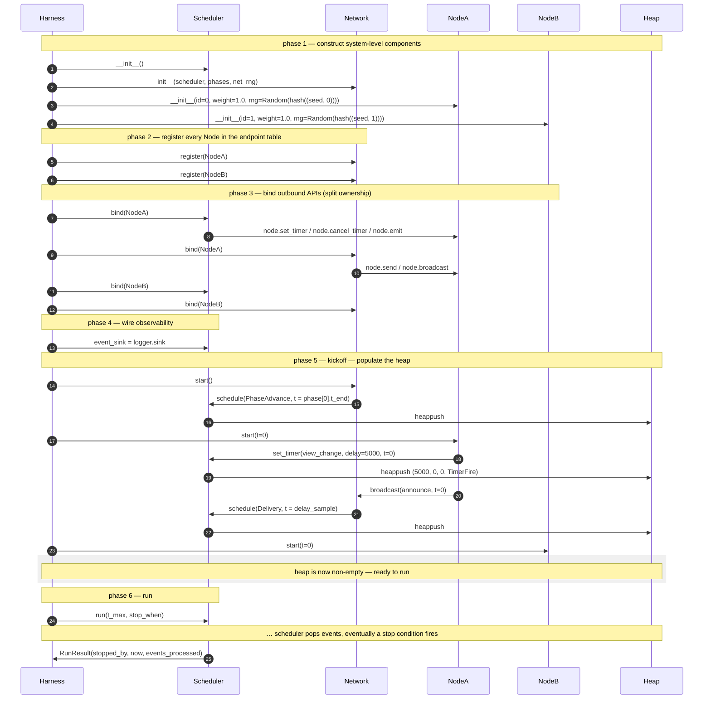

# Scheduler — Bootstrap and Binding

> How the harness constructs the system, wires every `Node`'s outbound
> API to the right component, and pushes the first events into the
> heap so `run()` has work to do.
>
> Part of the T17 contract diagram set. Navigation entry point:
> [[diagrams/index]]. Reading order: this diagram is first; it
> establishes the cast and the wiring split that subsequent diagrams
> assume.

## Diagram

## What this pins

**Six phases.** Construct → register → bind → observability → kickoff →
run. Each phase has exactly one responsibility; the harness drives all
six in this order.

**Binding is split across two components.** `Scheduler.bind(node)`
wires `set_timer` / `cancel_timer` / `emit`. `Network.bind(node)` wires
`send` / `broadcast`. The harness calls both for every Node. Each
component owns its own half; there is no `Scheduler → Network`
reference created by this wiring. The cyclic dependency hinted at in
[[concepts/network-model]] §5's reference sketch is avoided.

**Kickoff is per-`Node.start(t=0)`.** Whatever the FSM does in
`start()` — set a view-change timer, broadcast a primary's first
proposal, register a Snowman poll — is what populates the heap. If
`start()` does nothing, the heap is empty when `run()` is called and
the loop exits immediately with `stopped_by='quiescence'`. That is a
valid (empty) run.

**`node.start(t)` is a new seam.** [[concepts/node-model]] §6 declares
two inbound hooks (`on_message`, `on_timer`); T17 adds `start(t)` as
a third, called exactly once by the harness during kickoff. This is a
small extension to T14 and is registered as a Revisions entry on
[[concepts/node-model]] when T17 is finalised.

**`Network.start()` schedules phase boundaries.** If the experiment
config declares N phases, `Network.start()` enqueues N−1 `PhaseAdvance`
events at the phase boundaries. The scheduler treats them as ordinary
queued events; no special-case logic in the dispatch loop.

**`RunResult` plus the captured event-sink stream is the harness's
whole picture of the run.** That is everything T40 needs to build one
CSV row.

## Cross-links

- Scheduler API surface: [[concepts/simulation-design]] (forthcoming).
- Outbound API contract: [[concepts/node-model]] §7.
- Network seam: [[concepts/network-model]] §5; phase advancement:
  [[concepts/network-model-phases]] §5.
- Reproducibility seeding: [[concepts/reproducibility]] (T27,
  forthcoming).
- Adversary attachment surface (set on `Node.adversary`, not bound
  here): [[diagrams/scheduler/constraints]].

## Source

Authored as part of T17 ([[concepts/simulation-design]]).

## Revisions

None.
