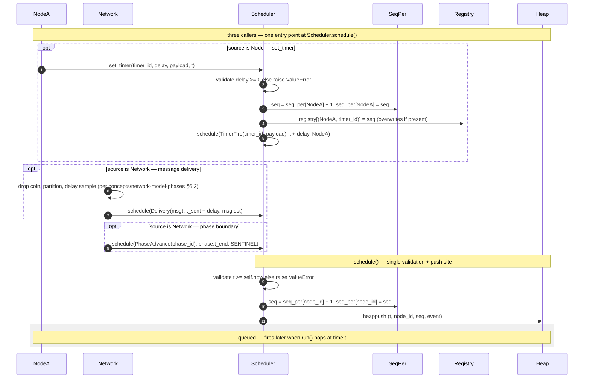

# Scheduler — Event Enqueue Path

> The single funnel: every event entering the heap goes through
> `Scheduler.schedule()`. This diagram shows all three sources (Node
> timer, Network delivery, Network phase advance) and the validation
> plus seq-assignment that `schedule()` performs.
>
> Part of the T17 contract diagram set. Reading order: comes after
> [[diagrams/scheduler/bootstrap]]; assumes the `bind()` wiring from
> that diagram is in place.

## Diagram

## What this pins

**One entry point.** `Scheduler.schedule(event, t, node_id)` is the
only way anything enters the heap. Three sources funnel through it:
Node `set_timer`, Network delivery scheduling, Network phase boundary
advancement. No other call surface; no back doors.

**Two validation gates.** `schedule()` rejects `t < self.now` (no time
travel). `set_timer()` rejects `delay < 0`. Both raise `ValueError`
immediately; the scheduler does not silently skip, clamp, or warn.
Failure is loud. See [[diagrams/scheduler/constraints]] for the full
catalogue.

**`seq` is per-Node monotonic.** Every call to `schedule()` increments
`seq_per[node_id]` and uses the new value. Two events scheduled at
the same `t` for the same `node_id` therefore differ in `seq`. Two
events scheduled at the same `t` for different `node_id`s differ in
`node_id` first. The tie-break key `(t, node_id, seq)` is uniquely
valued by construction — no ambiguity, no Python-fallback comparison
to the `event` field.

**`set_timer` writes the registry; `schedule` does not.** The
lazy-tombstone pattern depends on `registry`. Only `TimerFire` events
touch it. `Delivery` and `PhaseAdvance` events have no registry
interaction; they cannot be cancelled.

**`PhaseAdvance` uses a sentinel `node_id`.** Phase boundaries have no
Node owner. A reserved sentinel (`NodeId = -1` is the convention)
fills the `node_id` slot of the tie-break key. The sentinel never
collides with a real `NodeId` because real ids are non-negative
([[concepts/node-model]] §2).

**`set_timer` calls `schedule()` internally.** They are layered. The
"two validation gates" above are realised as the conjunction:
`set_timer` checks `delay >= 0`, then calls `schedule()` which checks
`t >= now`. Both must pass.

## Cross-links

- Schedule signature and validation: [[concepts/simulation-design]]
  (forthcoming) §3.
- Network's pre-schedule sampling (drop / partition / delay):
  [[concepts/network-model-phases]] §6.2.
- Tie-break key derivation: [[concepts/node-model]] §8.3 (this
  diagram's `seq_per` implementation realises the contract pinned
  there).
- Pop-side counterpart (dispatch, tombstone check):
  [[diagrams/scheduler/event-dispatch]].

## Source

Authored as part of T17 ([[concepts/simulation-design]]).

## Revisions

None.
