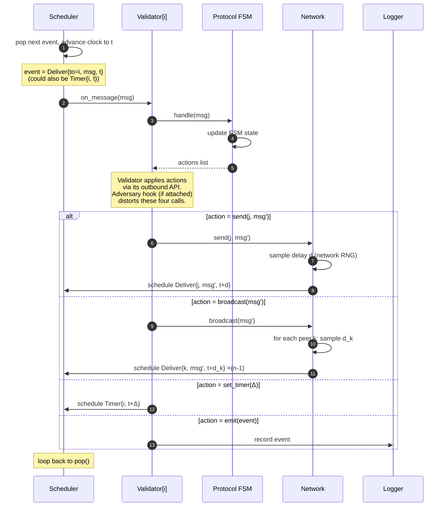

# Simulator Runtime — Inner Tick

> Drill-down into Phase 3 of [[diagrams/simulator-runtime-outer]].
> Answers: *between two `Scheduler.pop()` calls, what exactly happens?*
> This is the loop that runs millions of times per experiment and where
> the four models — Scheduler, Network, Validator, Protocol FSM — actually
> interlock.
>
> Navigation entry point: [[diagrams/index]].

## Diagram

## What each step does

The lifelines are the same four models from
[[diagrams/simulator-runtime-outer]] plus the Logger, drawn together
here because they all participate in every tick.

### Step 1 — Scheduler pops the next event

The Scheduler holds a priority queue of future events ordered by
scheduled time. Popping the head advances the model clock to that
event's time `t` and yields the event itself. Event kinds:

- **`Deliver{to, msg, t}`** — a message previously handed to the
  Network is now ready for delivery to its target Validator.
- **`Timer{i, t}`** — a Validator previously requested a wake-up at
  time `t`. Used for protocol timeouts (view-change in PBFT, slot
  ticks in Casper FFG, poll-round boundaries in Snowman, round
  advancement in Tusk).
- *(Workload events `tx_submit{tx, t}` look like deliveries; folded
  into the `Deliver` arm for clarity.)*

### Steps 2–4 — Validator handles the event

The Scheduler calls `on_message` (or `on_timer`) on the target
Validator. The Validator forwards the event to its Protocol FSM.
The FSM updates its state and returns a list of actions to perform.

The FSM is purely reactive: it never schedules events directly, never
calls the Scheduler, never touches the Network. All side-effects
flow back through the Validator's outbound API. This is what makes
each protocol's mechanism easy to swap in and out — the FSM is a
function of `(state, event) → (new_state, actions)`, nothing more.

The Adversary hook is invisible here by choice (see
[[diagrams/simulator-runtime-outer#init-steps-16-in-the-diagram]]).
On compromised Validators, the hook wraps the four outbound calls in
steps 5–10 below — it does not change the FSM. This matches
[[concepts/node-model]] §"T18 adversary attachment surface".

### Steps 5–10 — Validator applies actions (the four outbound calls)

The Validator's outbound API has exactly four verbs. Every action a
Protocol FSM can produce is one of these. The cardinality matters —
RQ4's four adversarial strategies map one-to-one onto distortions of
these four calls.

- **`send(j, msg')`** — unicast to peer `j`. The Network samples a
  delay from its configured distribution using a network-scoped RNG,
  then schedules a `Deliver` event at `t + d`. Drops are modelled
  by *not* scheduling — the message vanishes silently. Adversary
  override: rewrite `msg'`, change `j`, suppress.
- **`broadcast(msg')`** — repeat the above for every peer with an
  independent delay sample per peer. Adversary override: deliver
  different `msg'` to different peers (equivocation) or omit a
  subset (selective drop).
- **`set_timer(Δ)`** — schedule a Timer event on self at `t + Δ`.
  Adversary override: stretch or skip the timer (silent or delayed
  adversary).
- **`emit(event)`** — write a record to the Logger. Adversary
  override: typically none; the simulator's Logger is honest
  infrastructure even when the Validator is not, so that
  ground-truth metrics are still computable.

The `alt` block in the diagram shows the four cases as mutually
exclusive *per action*, but a single `handle(msg)` call may produce
several actions in sequence (e.g. PBFT's `PRE-PREPARE` handler
typically emits one log event + one broadcast).

### Step 11 — Loop

The Scheduler returns to `pop()`. The clock has advanced exactly to
the event's scheduled time and not a moment further. Empty time is
free.

## Why this picture matters

Three properties become legible only at this zoom:

- **The Scheduler owns time.** No other model advances its own clock.
  Replay with the same seed → same event ordering → same outputs.
  This is the basis of the T27 reproducibility contract.
- **The Validator owns its outbound API and nothing else.** It does
  not "send" in the colloquial sense — it asks the Network to deliver
  later. The Network is free to delay, drop, or duplicate. This
  separation is what lets one Network configuration shape the
  experimental result without any change to protocol code.
- **The four actions are the whole vocabulary.** Every protocol in
  scope (PBFT, Casper FFG, Snowman, Narwhal+Tusk) lives entirely
  within `send / broadcast / set_timer / emit`. The contract is
  pinned in [[concepts/node-model]] §"Outbound API"; the per-protocol
  message catalogue is [[concepts/message-types]]. If a protocol
  needs a fifth verb, that is a design-contract change, not a
  protocol-implementation choice.

## Source

Companion to [[diagrams/simulator-runtime-outer]]. Same scaffolding
status — drafted for eventual absorption into T17
([[concepts/simulation-design]]). No `wiki/log.md` entry, no
`TASKS.md` status change at this stage.

## Revisions

None.
